# AssetForge AI

AssetForge AI is an intelligent, AI-powered platform designed to automate the repurposing of creative assets for various social media and marketing platforms. This project was developed as part of a hackathon challenge and showcases a full-stack application with a sophisticated backend and a user-friendly frontend.

## Nano Banana Hackathon Submission

This project is a submission for the **Nano Banana Hackathon**, a 48-hour challenge to build innovative applications using the Gemini 2.5 Flash Image Preview model. The goal of this project is to showcase how advanced AI features can create a magical user experience and automate creative workflows at scale.

## Features

-   **AI-Powered Asset Analysis:** Automatically analyzes uploaded assets to detect faces, objects, and NSFW content.
-   **Automated Asset Repurposing:** Intelligently resizes and reformats assets for various platforms based on predefined rules and AI-driven analysis.
-   **Multi-Platform Support:** Supports a wide range of social media and marketing platforms, with the ability to add new platforms and formats.
-   **User and Organization Management:** A complete user management system with roles, permissions, and multi-tenancy through organizations.
-   **Admin Panel:** A comprehensive admin panel for managing users, platforms, formats, and application-level settings.
-   **User-Visible Admin Settings:** End-users can now view the admin-configured settings for their organization, providing transparency into the rules governing asset generation.
-   **Dynamic Prompt Suggestions:** The application provides AI-powered prompt suggestions to help users edit and customize their assets, enhancing the creative process.
-   **Asynchronous Task Processing:** Utilizes Celery and Redis to handle long-running tasks like asset analysis and generation without blocking the user interface.

> **Note:** While end-users can now **view** the admin-configured settings for their organization, they cannot control them. All application settings related to platform management, format management, and application rules are controlled and enforced by the **admin panel**.

## Demo

[Watch the Demo Video](demo.mp4)

## User Dashboard Features

### Configured Settings

Users can now see the settings configured by their organization's administrator directly on their dashboard. This provides transparency into the rules and guidelines that govern asset generation, including:

-   **AI Behavior:** The strategy used for image adaptation (e.g., "Crop" vs. "Extend").
-   **Upload Moderation:** Rules for file uploads, such as maximum file size and allowed types.
-   **Manual Editing:** Which editing features are enabled or disabled.
-   **Text Styles:** Pre-defined text style sets available for use.

### Dynamic Prompt Suggestions

To enhance the creative process, AssetForge AI now provides dynamic prompt suggestions. When a user is editing an asset, the system analyzes the asset's content and metadata to offer relevant and creative prompts, helping users to achieve their desired results more easily.

## Admin Panel Features

The admin panel provides a centralized location for managing all aspects of the application, from user and organization management to fine-grained control over the AI's behavior.

### Dashboard

The admin dashboard provides a high-level overview of the application's usage and statistics, including:

-   Total number of users
-   Total number of projects
-   Total number of generated assets
-   Active Celery workers

### User Management

The user management section allows administrators to:

-   View a list of all users in their organization.
-   Create, edit, and update user information, effectively onboarding new users into their organization.
-   Activate and deactivate users.

### Formats & Platforms

This section allows administrators to define the creative formats and platforms that are available to their users. This includes:

-   Creating and managing social media platforms (e.g., Instagram, Facebook).
-   Defining specific asset formats (e.g., "Instagram Post", "Facebook Story") with custom dimensions.

### Text Styles

Administrators can create and manage sets of predefined text styles that users can apply to their generated assets. This allows for consistent branding and a more streamlined user experience.

### Application Rules

This is where administrators can fine-tune the application's behavior to meet their specific needs. The rules are broken down into four categories:

-   **AI Behavior:** Control how the AI adapts and generates images (e.g., "Crop" vs. "Extend").
-   **Upload Moderation:** Set rules for file uploads, such as maximum file size and NSFW content detection.
-   **Manual Editing:** Enable or disable specific manual editing features for users.
-   **Adaptation:** Define the logic for how the AI should handle focal points in images.

### Analytics

The analytics section provides insights into how the application is being used, with data on:

-   User growth over time.
-   The distribution of projects by their status.
-   The number of assets generated for each format.

### System Health

The system health section provides a real-time overview of the status of the application's core components, including:

-   Database connectivity.
-   Redis connectivity.
-   The status of the Celery workers.

## Tech Stack

-   **Backend:**
    -   **Framework:** FastAPI
    -   **Language:** Python
    -   **Database:** PostgreSQL
    -   **ORM:** SQLAlchemy
    -   **Task Queue:** Celery
    -   **Message Broker:** Redis
    -   **Database Migrations:** Alembic
-   **Frontend:**
    -   **Framework:** Next.js
    -   **Language:** TypeScript
    -   **UI:** React, Tailwind CSS, shadcn/ui
-   **AI Provider:**
    -   Google Gemini
    -   OpenAI
-   **DevOps:**
    -   Docker, Docker Compose

## Architecture and Flow

## Multi-Tenant Architecture

AssetForge AI is built from the ground up as a "soft" multi-tenant application. This means a single instance of the application can serve multiple organizations, while keeping their data completely separate and secure. You do not need to spin up a dedicated application for each organization.

### How Multi-Tenancy and Data Isolation Work

1.  **User and Organization Creation:**
    *   When a new user registers for the application, a new **organization** is automatically created for them.
    *   The user's account is then linked to this new organization via an `organization_id`.

2.  **Admin and User Roles:**
    *   Each organization has its own set of users and administrators.
    *   An administrator for one organization has no access or visibility into any other organization.

3.  **Data Creation and Tagging:**
    *   Whenever a user or an admin creates any data in the application (a project, an asset, a setting, etc.), the backend automatically "tags" that data with the `organization_id` of the user who created it.

4.  **Data Retrieval and Isolation (The Magic):**
    *   This is the most critical part of the multi-tenant design. When a user or an admin logs in and requests data, the backend **always** filters the database queries by the `organization_id` of that logged-in user.
    *   This means that it's impossible for a user or admin from one organization to ever see or access the data of another organization.

### ERD (Entity-Relationship Diagram)

```mermaid
erDiagram
    ORGANIZATION {
        UUID id PK
        VARCHAR name
    }

    USER {
        UUID id PK
        UUID organization_id FK
        VARCHAR username
        VARCHAR email
        TEXT hashed_password
        BOOLEAN is_active
        VARCHAR role
        JSONB preferences
    }

    PROJECT {
        UUID id PK
        UUID organization_id FK
        UUID user_id FK
        VARCHAR name
        VARCHAR status
    }

    ASSET {
        UUID id PK
        UUID project_id FK
        VARCHAR original_filename
        TEXT storage_path
        VARCHAR file_type
        INTEGER file_size_bytes
        JSONB dimensions
        INTEGER dpi
        JSONB ai_metadata
    }

    GENERATION_JOB {
        UUID id PK
        UUID project_id FK
        UUID user_id FK
        VARCHAR status
        INTEGER progress
    }

    GENERATED_ASSET {
        UUID id PK
        UUID job_id FK
        UUID original_asset_id FK
        UUID asset_format_id FK
        TEXT storage_path
        VARCHAR file_type
        BOOLEAN is_nsfw
        JSONB manual_edits
    }

    REPURPOSING_PLATFORM {
        UUID id PK
        UUID organization_id FK
        UUID created_by_admin_id FK
        VARCHAR name
        BOOLEAN is_active
    }

    ASSET_FORMAT {
        UUID id PK
        UUID organization_id FK
        UUID platform_id FK
        UUID created_by_admin_id FK
        VARCHAR name
        VARCHAR type
        VARCHAR category
        INTEGER width
        INTEGER height
        BOOLEAN is_active
    }

    TEXT_STYLE_SET {
        UUID id PK
        UUID organization_id FK
        UUID created_by_admin_id FK
        VARCHAR name
        JSONB styles
        BOOLEAN is_active
    }

    APP_SETTING {
        SERIAL id PK
        UUID organization_id FK
        VARCHAR rule_key
        JSONB rule_value
        TEXT description
    }

    ORGANIZATION ||--o{ USER : has
    ORGANIZATION ||--o{ PROJECT : has
    ORGANIZATION ||--o{ REPURPOSING_PLATFORM : has
    ORGANIZATION ||--o{ ASSET_FORMAT : has
    ORGANIZATION ||--o{ TEXT_STYLE_SET : has
    ORGANIZATION ||--o{ APP_SETTING : has

    USER ||--o{ PROJECT : creates
    USER ||--o{ GENERATION_JOB : initiates

    PROJECT ||--o{ ASSET : contains
    PROJECT ||--o{ GENERATION_JOB : is_for

    ASSET ||--o{ GENERATED_ASSET : is_source_of

    GENERATION_JOB ||--o{ GENERATED_ASSET : produces

    REPURPOSING_PLATFORM ||--o{ ASSET_FORMAT : has

    USER ||--o{ REPURPOSING_PLATFORM : created_by
    USER ||--o{ ASSET_FORMAT : created_by
    USER ||--o{ TEXT_STYLE_SET : created_by
```



### Process Flow


## API Endpoints

### Authentication (`/auth`)

-   `POST /login`: User login.
-   `POST /refresh`: Refresh an access token.
-   `POST /logout`: User logout.
-   `POST /password-reset-request`: Request a password reset.
-   `GET /me`: Get the current user's information.
-   `PUT /me/preferences`: Update the current user's preferences.

### Users (`/users`)

-   `POST /`: Create a new user (admin only).
-   `GET /`: List all users (admin only).
-   `GET /{user_id}`: Get a user by ID (admin only).
-   `PUT /{user_id}`: Update a user (admin only).
-   `PUT /{user_id}/deactivate`: Deactivate a user (admin only).
-   `PUT /{user_id}/activate`: Activate a user (admin only).
-   `POST /register`: User self-registration.

### Projects (`/projects`)

-   `GET /`: Get the current user's projects.
-   `POST /upload`: Create a new project and upload assets.
-   `GET /recent-activity`: Get recent generation jobs for the user.
-   `GET /{project_id}`: Get project details.
-   `GET /{project_id}/status`: Get project status for polling.
-   `GET /{project_id}/preview`: Get AI analysis preview of assets.
-   `DELETE /{project_id}`: Delete a project.

### Generation (`/generate`)

-   `POST /`: Start a new generation job.
-   `GET /{job_id}/status`: Get generation job status.
-   `GET /{job_id}/results`: Get generation job results.
-   `GET /generated-assets/{asset_id}`: Get a single generated asset.
-   `PUT /generated-assets/{asset_id}`: Apply manual edits to a generated asset.
-   `POST /download`: Create a zip file of selected assets and returns it.

### Assets (`/assets`)

-   `GET /{original_asset_id}/generated`: Get all generated assets for a specific original asset.
-   `GET /{asset_id}/prompt-suggestions`: Generate dynamic prompt suggestions for editing an asset.

### Formats (`/formats`)

-   `GET /`: Get all available asset formats.

### Settings (`/settings`)

-   `GET /rules/ai-behavior`: Get the AI Behavior Controls for the user's organization.
-   `GET /rules/adaptation`: Get the Image Template Rules for the user's organization.
-   `GET /rules/upload-moderation`: Get the Content Moderation Rules for the user's organization.
-   `GET /text-style-sets`: Get the Text Style Sets for the user's organization.

### Admin (`/admin`)

-   `GET /stats`: Get statistics for the admin dashboard.
-   `GET /platforms`: List all repurposing platforms.
-   `POST /platforms`: Create a new repurposing platform.
-   `PUT /platforms/{platform_id}`: Update a platform.
-   `DELETE /platforms/{platform_id}`: Delete a platform.
-   `GET /formats`: List all asset formats.
-   `POST /formats`: Create a new asset format.
-   `PUT /formats/{format_id}`: Update an asset format.
-   `DELETE /formats/{format_id}`: Delete an asset format.
-   `GET /text-style-sets`: List all text style sets.
-   `POST /text-style-sets`: Create a new text style set.
-   `PUT /text-style-sets/{set_id}`: Update a text style set.
-   `DELETE /text-style-sets/{set_id}`: Delete a text style set.
-   `GET /rules/adaptation`: Get adaptation rules.
-   `PUT /rules/adaptation`: Update adaptation rules.
-   `GET /rules/ai-behavior`: Get AI behavior rules.
-   `PUT /rules/ai-behavior`: Update AI behavior rules.
-   `GET /rules/upload-moderation`: Get upload moderation rules.
-   `PUT /rules/upload-moderation`: Update upload moderation rules.
-   `GET /rules/manual-editing`: Get manual editing rules.
-   `PUT /rules/manual-editing`: Update manual editing rules.

### Analytics (`/analytics`)

-   `GET /user-growth`: Get user growth data.
-   `GET /project-status`: Get the distribution of projects by status.
-   `GET /generation-by-format`: Get the count of generated assets by format.

### Monitoring (`/monitoring`)

-   `GET /celery/workers`: Get Celery worker statistics.
-   `GET /celery/task/{task_id}`: Get the status of a specific Celery task.
-   `POST /celery/task/{task_id}/cancel`: Cancel a running Celery task.
-   `POST /maintenance/cleanup`: Trigger maintenance tasks.
-   `GET /health-check`: Perform a health check on all system components.

## Getting Started

### Prerequisites

-   Docker
-   Docker Compose

### Installation

1.  **Unzip the project:**

    Unzip the `NanoBanaHackathon-AssetForgeAI.zip` file to a location of your choice.

2.  **Navigate to the project directory:**

    ```bash
    cd NanoBanaHackathon-AssetForgeAI
    ```

3.  **Set up environment variables:**

    Navigate to the `backend-fast` directory and create a `.env` file from the example:

    ```bash
    cd backend-fast
    cp .env.example .env
    ```

    You will need to fill in the required environment variables in the `.env` file, such as your AI provider API keys.

4.  **Build and run the application:**

    -   **For Linux and macOS:**

        ```bash
        make docker-up
        ```

    -   **For Windows:**

        ```bash
        docker-compose -f AssetForgeAI/docker-compose.yml up --build -d
        ```

    This will build the Docker images for the frontend and backend services and start all the containers.

### Usage

-   **Frontend:** The frontend is accessible at `http://localhost:3000`.
-   **Backend API:** The backend API is accessible at `http://localhost:8000`.
-   **Flower (Celery Monitoring):** The Flower dashboard for monitoring Celery tasks is accessible at `http://localhost:5555`.

### Seeding Test Data

To make it easy to test the multi-tenancy features of the application, a script is provided to seed the database with test data. This script will create two organizations (Company A and Company B), each with its own administrator and a set of test users.

To run the script, make sure the application is running (`make docker-up`), and then execute the following command from the root of the project:

```bash
python seed_test_data.py
```

For Linux and macOS users, the original bash script is also available:

```bash
./seed_test_data.sh
```

## Makefile Commands

The `Makefile` in the root directory provides several useful commands for managing the application:

-   `make docker-up`: Builds and starts all services with Docker Compose.
-   `make docker-down`: Stops all Docker services.
-   `make docker-build`: Builds the Docker images for all services.
-   `make install`: Installs the Python dependencies for the backend.
-   `make dev`: Starts the backend development server.
-   `make test`: Runs the backend tests.

## Future Improvements

-   **Enhanced AI Capabilities:** Integrate more advanced AI features, such as style transfer and automated background removal.
-   **Real-time Collaboration:** Implement real-time collaboration features to allow multiple users to work on the same project simultaneously.
-   **Expanded Platform Support:** Add support for more social media and marketing platforms.
-   **Improved Analytics:** Provide more detailed analytics and reporting on asset performance.
